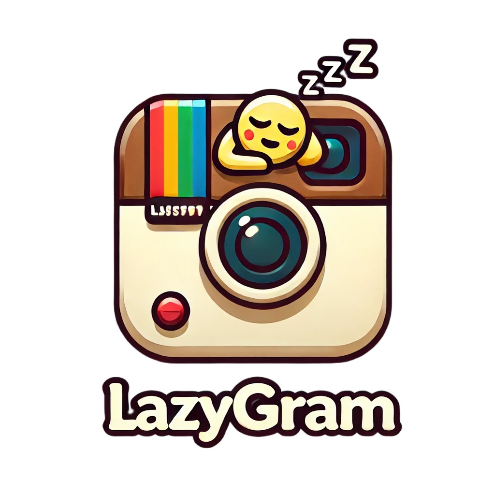

# PROYECTO LLMs : GENERADOR DE CONTENIDO

  

# LazyGram 💤

LazyGram is a content generation tool designed to create personalized text content for various platforms and audiences. Powered by **Gemini 1.5 Pro** and **Dreamlike 2.0**, LazyGram adapts user-provided prompts to generate engaging content tailored to specific platforms like **Twitter**, **Instagram**, and more.

## Features
### Tab1: Platform-Aware Content Creation
- **Platform-Specific Generation**:
  - Generate concise tweets (Twitter/X) with a limit of 280 characters.
  - Create engaging Instagram posts with up to 2,200 characters and up to 10 pictures.
  - Write professional LinkedIn posts with a limit of 3,000 characters.
  - Generate long-form articles for blogs on any topic.

- **Language Support**:
  - Generate content in multiple languages, including:
    - English (`en`)
    - Spanish (`es`)
    - Italian (`it`)
    - French (`fr`)
    - Dutch (`nl`)
    - Ukrainian (`ua`)

- **Personalization**:
  - Option to include company or personal information in the prompt for personalized content generation.

### Tab2: Scientific Content Creation with RAG (Retrieve-and-Generate)
- **Retrieve-and-Generate Workflow**:
  - Combines document retrieval with generative AI for tailored scientific summaries.
  - Uses **FAISS** for similarity search and **HuggingFace embeddings** to create a vectorized document retrieval system.

- **Targeted Scientific Topics**:
  - **Physics**: Latest developments in physics research.
  - **Mathematics**: Advanced mathematical theories and applications.
  - **Computer Science**: Cutting-edge computer science innovations.
  - **Biology**: Recent breakthroughs in biological sciences.
  - **Economics**, **Finance**, **Statistics**, **Electrical Engineering**, and **Systems Science** are also supported.

- **Public Context Levels**:
  - Content is adapted for different audience types:
    - **First Grader**: Simplified explanations with playful analogies.
    - **Middle Schooler**: Moderate complexity with relatable examples.
    - **High Schooler**: Deeper conceptual understanding with some technical terms.
    - **NonExpert**: Accessible content for non-specialists.
    - **General Public**: Broadly appealing content with engaging storytelling.

- **Workflow**:
  1. Fetch relevant documents using Arxiv's search API for scientific research summaries.
  2. Vectorize and store documents using FAISS.
  3. Retrieve the most relevant documents based on user queries.
  4. Use **Gemini 1.5 Pro** to generate context-aware summaries with defined complexity levels and audience-specific styles.

---

## Technology Stack
- **Models**: Gemini 1.5 Pro/Flash, Stable Diffusion v2/Dreamlike Photoreal 2.0, HuggingFace Embeddings.
- **Document Retrieval**: FAISS, Arxiv Search.
- **Frontend**: Streamlit.
- **Backend**: Google Cloud for deployment and scalability.

## Deployment
LazyGram is deployed on **Google Cloud** and can be accessed via the following link:

---

## Usage
### Tab1: Platform-Aware Content Creation
1. Visit the LazyGram app using the link above.
2. Select the platform (e.g., Twitter, Instagram) from the dropdown menu.
3. Choose the desired language for your content.
4. Enter the prompt or topic you want to generate content about.
5. (Optional) Add company or personal context for personalized content.
6. (Optional) Select the number of images you want to generate.
7. Click the **Generate** button to create your content.
8. The generated content will be displayed below for review and use.

### Tab2: Scientific Content Creation with RAG
1. Navigate to the **Scientific Content Creation** tab.
2. Choose a **scientific topic** (e.g., Physics, Computer Science).
3. Select the **target audience** level (e.g., NonExpert, Firstgrader).
4. Enter a **query** or leave blank to explore general content.
5. (Optional) Specify the maximum number of results to retrieve.
6. Click the **Generate** button to:
   - Fetch relevant scientific documents.
   - Generate an accessible and engaging summary tailored to your audience.
7. Review and refine the output as needed.

---
